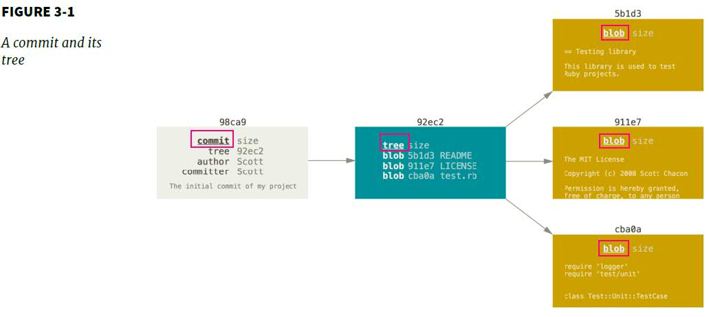
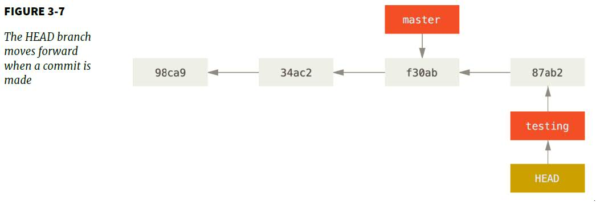

### Branches in a Nutshell

> Some people refer to Git's branching model as its "killer feature". 
A branch in Git is simply a lightweight movable pointer to commits

- A branch represents an independent line of development. 
- A way to request a brand new working directory, staging area, and project history.
- New commits are recorded in the history for the current branch, which results in a fork in the history of the project.

### A Commit and its Tree

When you create a commit by `git commit`:
- Git checksum each subdirectory
- Stores those tree objects
- Creates a commit object that has metadata and a pointer to the tree

### How does Git know that what branch you're currently on?
> It keeps a special pointer called `HEAD` to the local branch. The `HEAD` branch moves forward when a commit is made.

