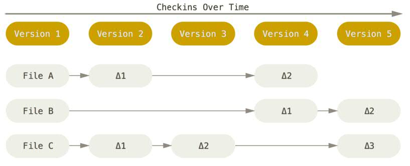
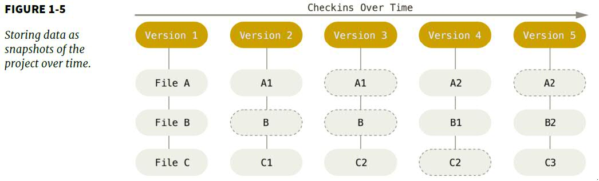
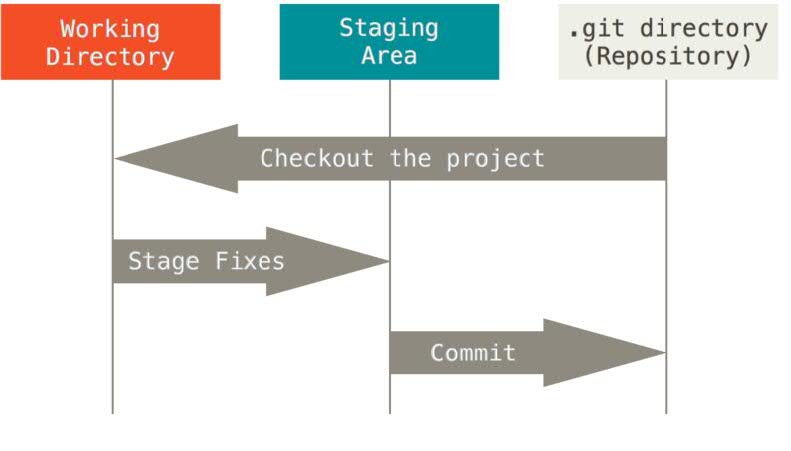

### The way Git thinks about its data

- A set of files and changes made to each file over time


- A stream of snapshots



### The three states
- modified
- staged
- committed

### The three main sections
- Working directory
- Staging area
- Git directory

### The basic workflow



### Common-used command

#### git config
There are three different places to store git settings:
```
1. /etc/gitconfig: for every users on the system, `--system`
2. ~/.gitconfig or ~/.config/git/config: specific to your user, `--global`
3. <working_dir>/.git/config: specific to the single repository
```

#### git diff
```
- git diff
- git diff --staged/--cached
- git difftool, run `git difftool --tool-help` to see what is available on your system.
```

#### git mv

#### git rm (-f)

#### git log (-p) (-2) (--stat) (--pretty=oneline) (--pretty=format:"%h %s" --graph)

#### git commit --amend
Undoing Things: the second commit replaces the results of the first.
```
git commit -m "initial commit"
git add forgotten_file
git commit --amend
```

#### git reset HEAD \<file\>
Unstaging a Staged file: 

#### git checkout -- \<file\>
Unmodifying a Modified file: git copys another file over it.
  
#### git remote
Working with remotes:
```
git remote
git remote -v
git remote add <shortname> <url>
git fetch <remote-name/shortname>, i.e., git fetch origin

# git fetch vs. git pull
# fetch: downloads the data to local repository, does't merge it
# pull: fetch and merge

# To see more information about a particular remote
git remote show [remote-name]
git remote show origin

git remote rename current-name tobe-name
git remote rm [remote-name]
```


